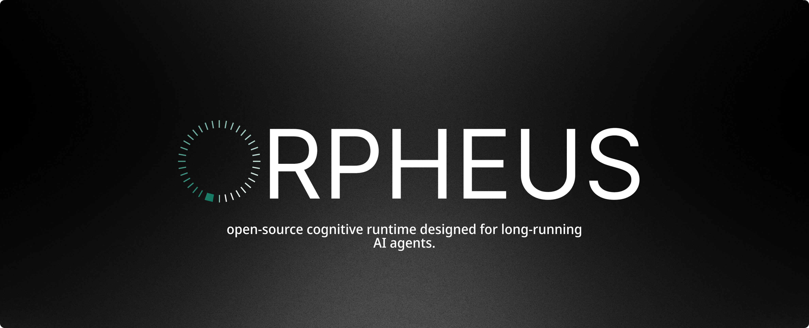
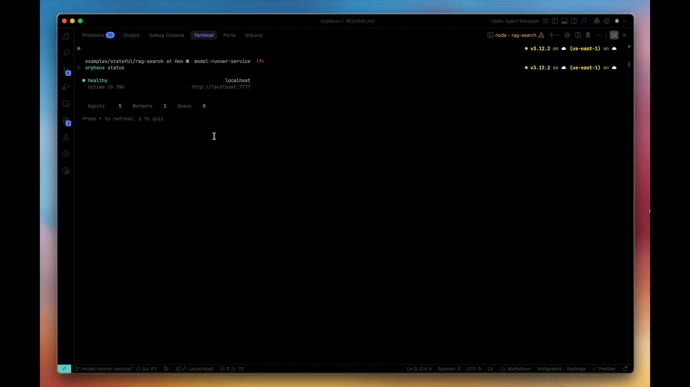
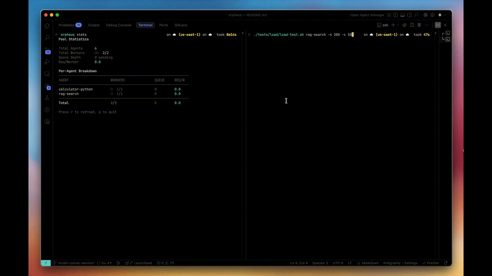
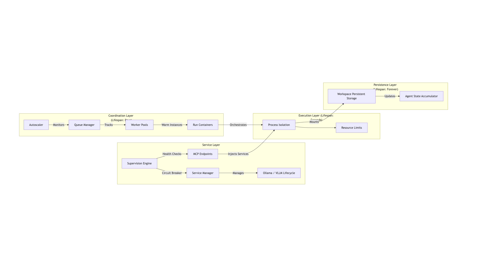

<p align="center">
  
</p>

[](https://go.dev/)
[](https://www.typescriptlang.org/)
[](LICENSE)


Orpheus is infrastructure for AI agents that need to maintain state, run for extended periods, and scale dynamically. It uses queue-depth autoscaling and lightweight runc containers to handle agent workloads that traditional serverless platforms can't support.

Built for agents that call LLMs, orchestrate multi-step workflows, and maintain context across invocations—Orpheus provides the execution layer with persistent workspaces, built-in streaming, and production-grade supervision.

**Key capabilities:**

- **Sub-second container startup** using runc instead of Docker
- **Queue-depth autoscaling** that scales on pending work, not CPU metrics
- **Persistent workspaces** that survive container restarts and worker recycling
- **MCP endpoints** — Every deployed agent is automatically discoverable via Model Context Protocol
- **Built-in SSE streaming** for real-time agent output
- **vLLM/Ollama integration** with automatic lifecycle management
- **Production supervision** with circuit breakers, backoff, and OOM handling
- **Prometheus metrics** — Built-in `/metrics` for queue depth, workers, and executions


<p align="center">
  
</p>

---

## Getting Started

### Quick Start (Recommended)

One command sets up everything:

```bash
git clone https://github.com/orpheus-systems/orpheus
cd orpheus
./scripts/orchestrators/setup-local.sh
```

This automatically:

- ✅ Installs dependencies (Go, Node.js)
- ✅ Sets up Lima VM (macOS) or runc (Linux)
- ✅ Builds daemon and CLI
- ✅ Links `orpheus` command globally

**Time:** ~3-5 minutes on first run.

After setup completes, follow the printed instructions to start the daemon.

### Manual Setup

If you prefer manual control:

```bash
# macOS: Install Lima for container execution  
brew install lima
limactl start default

# Linux: Install runc and podman
sudo apt-get install -y runc podman

# Build
make build

# Start daemon (Linux)
sudo ./bin/orpheusd

# Start daemon (macOS - inside Lima VM)
limactl shell default
cd /path/to/orpheus && sudo ./bin/orpheusd --tcp-bind 0.0.0.0:7777
```

### Deploy Your First Agent

Create two files in a directory:

**agent.yaml** — Configuration with `entrypoint` pointing to your handler function:

```yaml
name: my-agent
runtime: python3
module: agent
entrypoint: handler    # This is the function Orpheus will call
memory: 256
timeout: 180

scaling:
  min_workers: 1
  max_workers: 10
```

**agent.py** — Your code with the handler function matching `entrypoint`:

```python
async def handler(input_data: dict) -> dict:
    """
    This function name must match 'entrypoint' in agent.yaml.
    Orpheus calls this function with the request body as input_data.
    """
    query = input_data.get('query', '')

    # Your agent logic here
    # Files written to /workspace persist across executions

    return {
        "response": f"Processed: {query}",
        "status": "success"
    }
```

**Deploy and run:**

```bash
# Connect CLI to daemon
orpheus connect http://localhost:7777

# Deploy agent
orpheus deploy .

# Invoke
orpheus run my-agent '{"query": "hello world"}'
```


---

## Features

### Lightweight Execution

- **Sub-second container startup** — Uses runc directly, not Docker daemon
- **Workers stay warm** — No cold starts; agents ready immediately
- **Resource isolation** — Linux namespaces and cgroups per execution

### Queue-Depth Autoscaling

- **Scales on pending work** — Monitors queue depth, not CPU/memory
- **Optimized for I/O-bound agents** — Handles LLM API wait times efficiently
- **Rapid response** — Scales in seconds, not minutes

```bash
# Load test to see autoscaling in action
./tests/load/load-test.sh my-agent -n 200 -c 50
```


<p align="center">
  
</p>

### Persistent Workspaces

- **`/workspace` survives everything** — Container restarts, worker recycling, daemon restarts
- **Agent memory accumulates** — Session state, caches, and files persist
- **Framework-native** — LangChain, LlamaIndex session storage works automatically

### MCP Integration

Every deployed agent automatically gets an MCP (Model Context Protocol) endpoint. LLMs can discover and invoke your agents as tools without additional configuration.

```
mcp://your-server:7777/agents/my-agent
```

### Model Server Management

- **Automatic lifecycle** — Orpheus starts, monitors, and restarts model servers
- **Platform-aware** — Ollama on macOS (Metal), vLLM on Linux (CUDA)
- **Supervision policy** — Circuit breaker, exponential backoff, OOM detection

```yaml
# GPU inference (Linux + NVIDIA)
engine: vllm
model: mistralai/Mistral-7B-Instruct-v0.2

# Local models (macOS/Linux)
engine: ollama
model: mistral
```

### Production Supervision

- **Circuit breaker** — Token bucket prevents restart storms (5 max per 5 min)
- **Exponential backoff** — 2s → 4s → 8s → ... → 60s max with ±20% jitter
- **OOM handling** — Exit code 137 triggers aggressive 60s minimum backoff
- **Health monitoring** — Automatic recovery on failure

### Built-in Streaming

- **Server-Sent Events (SSE)** — Stream agent output in real-time
- **Progress updates** — Agents can emit intermediate state during execution

```bash
curl -H "Accept: text/event-stream" \
  http://localhost:7777/v1/agents/my-agent/run \
  -d '{"query": "analyze this"}'
```

### Observability

- **Prometheus metrics** — Built-in `/metrics` endpoint for monitoring
- **Queue depth visibility** — See the metric that actually matters for scaling
- **Zero configuration** — Works out of the box with Grafana, Datadog, etc.

```bash
# See your queue depth in real-time
curl http://localhost:7777/metrics | grep orpheus_queue_depth

# Example output:
# orpheus_queue_depth{agent="my-agent"} 12
```

---

## Architecture

<p align="center">
  
</p>


---

## CLI Reference

```bash
# Connection
orpheus connect <url>           # Connect to daemon
orpheus status                  # Check pool state

# Deployment
orpheus deploy <path>           # Deploy agent
orpheus undeploy <name>         # Remove agent
orpheus list                    # List agents

# Execution
orpheus run <agent> [input]     # Execute agent
orpheus runs [agent]            # View execution history

# Workspace
orpheus workspace info <agent>  # View workspace files
orpheus workspace clean <agent> # Clean workspace
```

<!-- GIF: CLI commands in action -->

---

## Configuration

### agent.yaml

```yaml
name: my-agent
runtime: python3          # python3 | nodejs20
module: agent             # filename without extension
entrypoint: handler       # function name to call
memory: 256               # MB
timeout: 180              # seconds

# Optional: Local model
engine: ollama            # ollama | vllm
model: mistral

# Optional: Scaling
scaling:
  min_workers: 1
  max_workers: 10
  queue_size: 200

# Optional: Environment
env:
  - OPENAI_API_KEY
```

---

## Deployment

### Local Development

Use the automated setup script:

```bash
./scripts/orchestrators/setup-local.sh
```

Or with options:

```bash
./scripts/orchestrators/setup-local.sh --skip-ollama  # Skip Ollama setup
./scripts/orchestrators/setup-local.sh --help         # See all options
```

**macOS Note:** Orpheus uses [Lima](https://lima-vm.io/) to run Linux containers. The setup script handles this automatically—no manual VM configuration needed.

### Production (Linux Server)

```bash
# Build for Linux
make build-linux-amd64

# Deploy to server
make deploy SERVER=ubuntu@your-server SSH_KEY=~/.ssh/key.pem

# Install as systemd service
make deploy-systemd SERVER=ubuntu@your-server SSH_KEY=~/.ssh/key.pem
```

**Requirements:**

- Ubuntu 22.04+ (or any Linux with runc)
- runc, podman
- NVIDIA GPU + CUDA (optional, for vLLM)

---

## Examples

```
examples/
├── basic/
│   ├── calculator-python/     # Simple Python agent
│   └── calculator-nodejs/     # Simple Node.js agent
├── long-running/
│   └── competitive-analysis/  # Multi-phase workflow
├── stateful/
│   ├── conversational-memory/ # Context persistence
│   └── rag-search/            # RAG with FAISS
└── memory-intensive/
    └── embedding-cache/       # Memory tracking
```

---

## Development

### Build from Source

```bash
git clone https://github.com/orpheus-systems/orpheus
cd orpheus
make build
```

### Run Tests

```bash
make test
```

---

## License

Orpheus is open source under the [Apache License 2.0](LICENSE).

